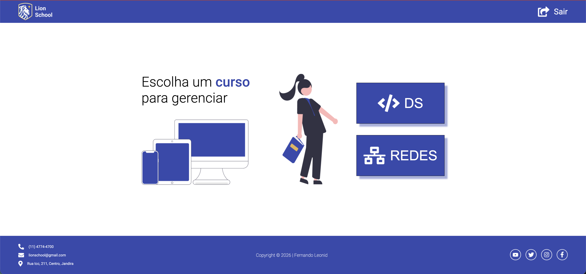

    

<h1 align="center">Projeto Simulador Cursos</h1>

Com a volta às aulas no SENAI, os alunos já retornam ao ritmo intenso de aprendizado prático, que é uma das marcas da instituição. Logo nos primeiros dias, as atividades não ficam apenas na teoria: já começamos colocando a mão no código e desenvolvendo projetos reais.

Um dos destaques desse início é a integração entre front-end e back-end em um projeto simples, mas muito importante para consolidar o conhecimento. No front-end, trabalhamos com a interface, criando páginas responsivas e interativas com HTML, CSS e JavaScript. Já no back-end, focamos na lógica, no processamento de dados e na comunicação com servidores, utilizando tecnologias que permitem dar vida às aplicações.

Essa integração é essencial, pois mostra como tudo se conecta no desenvolvimento de sistemas. Não se trata apenas de fazer algo “bonito” na tela, mas de garantir que funcione de verdade, com dados sendo enviados, recebidos e processados corretamente.

Assim, o retorno às aulas no SENAI já começa de forma dinâmica, prática e desafiadora, preparando os alunos para situações reais do mercado de trabalho e incentivando o desenvolvimento de habilidades completas na área de tecnologia.
